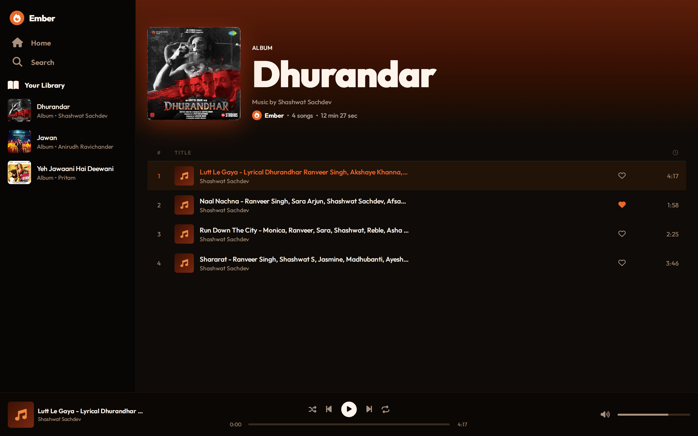
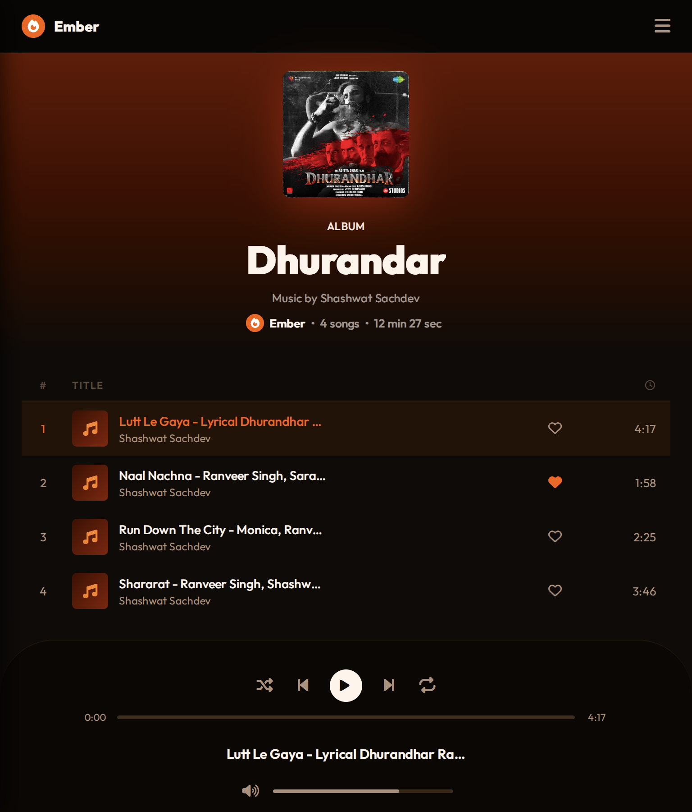
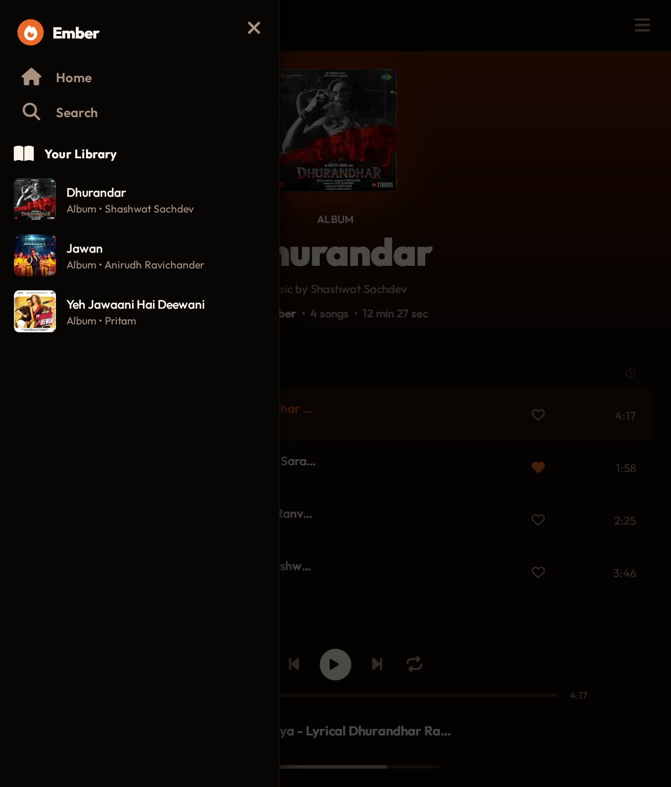
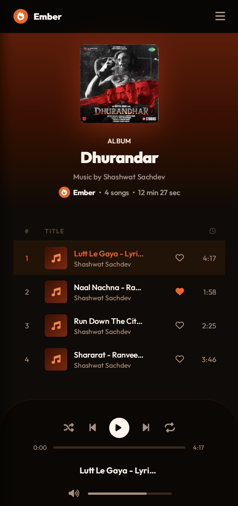

# Ember 
A sleek, responsive web-based music player built with **vanilla HTML5, CSS3, and JavaScript**, featuring smooth audio controls, custom progress tracking, dynamic album loading, and persistent favorites.

## 📦 Tech Stack
- **HTML5** — Semantic architecture for clean markup  
- **CSS3** — Custom properties, Flexbox, and Grid layouts  
- **JavaScript ES6+** — Async/Await, Web Audio Context, and dynamic state handling  
- **Font Awesome** & **Google Fonts** — Modern icons and typography  

## 🚀 Quick Start
⚠️ **Note:** Opening `index.html` directly via `file://` will trigger **CORS errors** due to the `fetch` API. Use a local server.

1. Clone the repository: `git clone https://github.com/ayanattaarbab/ember.git`
2. Open the folder in **Visual Studio Code**.  
3. Install the **Live Server** extension (by Ritwick Dey).  
4. Verify the API endpoint in `js/script.js` (default: `http://127.0.0.1:3000/`).  
5. Click **Go Live** in VS Code to launch the app.  

## ✨ Features
- **Dynamic Album Loading** — Auto-indexes albums with metadata and artwork  
- **Custom Audio Controls** — Play, pause, shuffle, repeat, and volume sliders  
- **Interactive Tracklist** — Hover and click actions for instant playback  
- **Favorites Persistence** — Save tracks/albums with `localStorage`  
- **Responsive UI** — Optimized for desktop, tablet, and mobile views  

## 🎹 System Controls
- **Album Card Click** — Loads album tracks dynamically  
- **Track Row Hover** — Displays interactive play toggle overlay  
- **Track Row Click** — Plays selected audio instantly  
- **Heart Icon Toggle** — Adds/removes favorites in persistent storage  
- **Progress Bar & Volume Slider** — Real-time scrubbing and gain control  
- **Shuffle & Repeat** — Queue randomization or loop modes  
- **Hamburger Menu (Mobile)** — Smooth sidebar transitions  

## 🤖 Core Engineering
- **Dynamic Asset Engine** — Scans album directories and injects metadata into DOM  
- **Custom Audio Wrapper** — Extends native `Audio()` with interactive scrubbers  
- **Geometric Scrubber Math** — Precise drag tracking for progress bar updates  
- **Persistent Storage Hub** — Syncs favorites via `localStorage` across sessions  

## 📁 Project Structure
```plaintext
Ember/
├── index.html          # Main app structure
├── favicon.png         # Tab icon
├── css/
│   └── style.css       # Layout styles & theme variables
├── js/
│   └── script.js       # State machine & audio logic
├── assets/             # Screenshots & repo media
│   ├── desktop.png     
│   ├── tablet-main.png     
│   ├── tablet-sidebar.png     
│   ├── mobile-main.png 
│   └── mobile-sidebar.png 
└── albums/             # Local audio directories
    └── example-album/  
        ├── info.json   # Album metadata
        ├── cover.jpg   # Album artwork
        ├── song1.mp3   # Track file
        └── song2.mp3   # Track file
```

## 🎵 Music Assets Setup
Each album folder inside `albums/` must include:
- `info.json` → metadata (`title`, `artist`)  
- `cover.jpg` → album artwork  
- `.mp3` files → audio tracks  

Example `info.json`:
```json
{
  "title": "Album Title",
  "artist": "Artist Name"
}
```

## 🖼️ Preview

### Desktop


### Tablet



### Mobile


